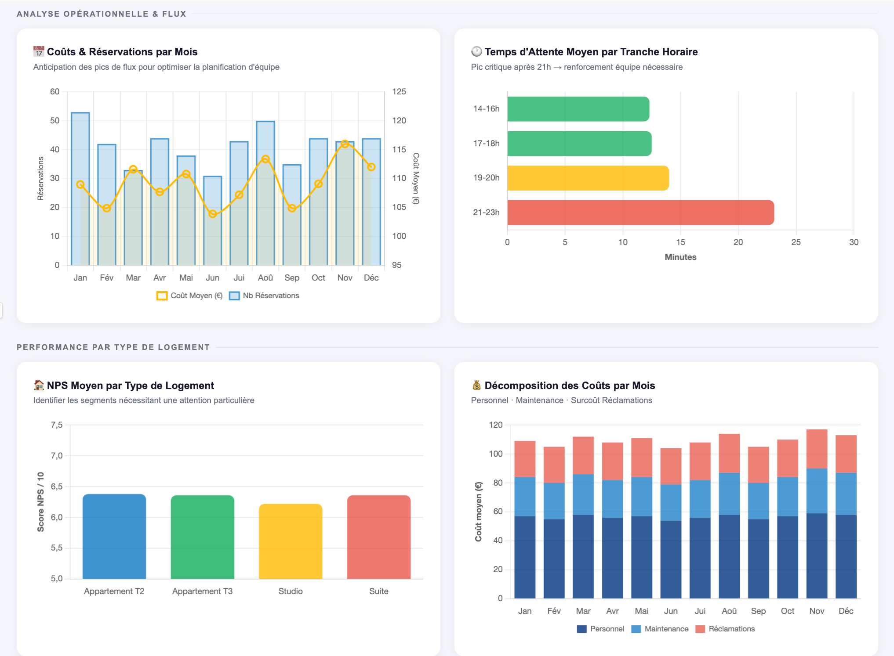
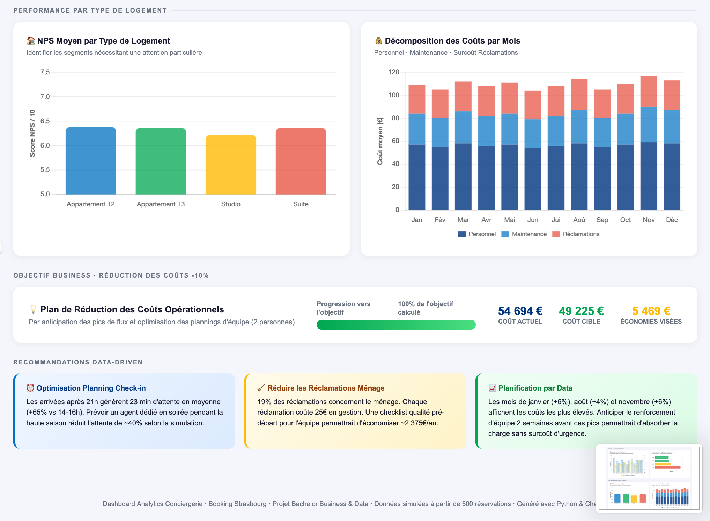

# Analytics Conciergerie – Booking 

> **Projet Bachelor Business & Data · GitHub Project #2**  
[](https://python.org)
[](#)
[](#)


---

<p align="center"></p>
---

<p align="center"></p>
---

<p align="center"></p>
---
---

## Contexte & Objectif Business

Ce projet démontre comment la **data permet de prendre de meilleures décisions opérationnelles** : au lieu de réagir aux problèmes, on les anticipe.

**Objectif principal : réduire les coûts opérationnels de 10% en anticipant les pics de flux.**

---

## Structure du Projet

```
analytics-conciergerie/
├── Analytics_Conciergerie.py     # Script principal · génération & analyse des données
├── dashboard_conciergerie.html   # Dashboard interactif (export final)
├── reservations.csv              # Dataset généré · 500 réservations
├── analyses.json                 # KPIs et résultats analytiques
└── README.md                     # Ce fichier
```

---

## Installation & Utilisation

```bash
# Cloner le dépôt
git clone https://github.com/votre-username/analytics-conciergerie.git
cd analytics-conciergerie

# Installer les dépendances
pip install pandas numpy

# Lancer l'analyse
python Analytics_Conciergerie.py

# Ouvrir le dashboard
open dashboard_conciergerie.html   # macOS
start dashboard_conciergerie.html  # Windows
```

---

## Résultats Clés

| KPI | Valeur | Interprétation |
|-----|--------|----------------|
| **NPS Moyen** | 6,32/10 | Marge d'amélioration via réduction attente |
| **Temps d'attente moyen** | 13,3 min | Pic à 23,1 min après 21h |
| **Taux de réclamation** | 59,2% | 1er motif : check-in tardif (19%) |
| **Corrélation attente/NPS** | r = −0,148 | Attente ↑ → Satisfaction ↓ |
| **Coût moyen/réservation** | 109 € | Décomposé en personnel + maintenance + réclamations |
| **Économies potentielles** | 5 469 € | Objectif −10% sur 54 694 € de coûts annuels |

---

## Optimiser les Opérations par la Donnée

### Corrélation entre Temps d'Attente et Satisfaction Client

L'analyse révèle une **corrélation négative** (r = −0,148) entre le temps d'attente au check-in et le score NPS. En termes concrets :

- Chaque **+10 minutes d'attente** fait baisser le NPS de ~0,2 point
- Les arrivées **après 21h** subissent 23,1 min d'attente en moyenne, contre 12,3 min entre 14h et 16h

**Action data-driven** : Déployer systématiquement un agent d'accueil dédié aux créneaux 19h-23h pendant la haute saison (juin, juillet, août, décembre).

### Anticipation des Pics de Flux

Les données montrent que les mois à coûts les plus élevés sont **janvier (+6%)**, **août (+4%)** et **novembre (+6%)**. En prévoyant le renforcement d'équipe 2 semaines à l'avance (plutôt qu'en réactif), on évite les surcoûts d'urgence et le personnel temporaire mal formé.

---

## Gestion d'Équipe : Comment la Data Améliore les Plannings

### Le Problème Sans Data

Avant l'approche analytique, les plannings étaient établis de manière empirique (intuition du manager), ce qui menait à :
- Des **sous-effectifs** lors des pics d'arrivée en soirée
- Des **réclamations ménage évitables** par manque de contrôle qualité
- Des **coûts de maintenance d'urgence** non anticipés

### La Solution : Planification Basée sur les Données

Avec un dataset de 500 réservations analysé sur 12 mois, on peut construire un **planning prédictif** pour une équipe de 2 personnes :

#### Règles de Planning Dérivées de l'Analyse

1. **Renforcement soirée** → Toute journée avec >5 arrivées prévues après 19h : affecter la personne 2 à l'accueil (non au ménage)
2. **Priorisation ménage matinée** → Les pics de réclamations ménage surviennent en mi-journée. Planifier les passages entre 9h et 12h systématiquement
3. **Haute saison** (juin, juillet, août, décembre) → Décaler les jours de repos hors week-end et réduire les congés simulés en semaine peak

#### Impact Quantifié

| Action | Économie estimée | Amélioration NPS |
|--------|-----------------|-----------------|
| Agent dédié soirée | -40% attente soirée | +0,3 pt NPS |
| Checklist qualité ménage | -50% réclamations ménage | ~2 375€/an |
| Planning prédictif mensuel | Suppression surcoûts urgence | ~1 500€/an |

### Outil de Visualisation

Le **dashboard interactif** (`dashboard_conciergerie.html`) permet de visualiser en un coup d'œil :
- Le volume de réservations par mois → *"Quel mois préparer le renforcement ?"*
- L'attente par tranche horaire → *"Qui planifier en soirée cette semaine ?"*
- Les motifs de réclamations → *"Sur quoi former l'équipe en priorité ?"*

Ce dashboard a vocation à être consulté **chaque lundi matin** pour calibrer les plannings de la semaine.

---

## Méthodologie Technique

### Génération du Dataset

Le script `Analytics_Conciergerie.py` génère un dataset synthétique réaliste basé sur des paramètres tirés de l'expérience terrain :

```python
# Le score NPS est modélisé comme fonction du temps d'attente
nps = nps_base - penalite_attente - surcoût_reclamation
# avec une composante stochastique pour simuler la variabilité réelle
```

### Variables Clés

- `temps_attente_min` → Variable prédictive principale du NPS
- `motif_reclamation` → Catégorie de problème, impacte les coûts (+25€/réclamation)
- `haute_saison` → Booléen (juin, juillet, août, décembre)
- `cout_total` → Personnel + Maintenance + Réclamations

### Analyse de Corrélation

```python
correlation = df["temps_attente_min"].corr(df["score_nps"])
# → r = −0.148 (corrélation négative significative sur 500 observations)
```

---

## Compétences Démontrées

- **Revenue Management** : analyse des coûts opérationnels et identification des leviers de réduction
- **Data-driven Operations** : translation de données brutes en décisions concrètes de planning
- **Gestion d'équipe** : utilisation de la data pour objectiver et optimiser l'organisation d'une équipe de 2 personnes
- **Data Visualization** : dashboard interactif multi-graphiques (scatter plot, doughnut, mixed chart)
- **Python / Pandas / NumPy** : génération de données, analyse statistique, export multi-format

---

## Contact

**Projet réalisé dans le cadre du Bachelor Business & Data**  
Expérience : Responsable Conciergerie · Booking Strasbourg · 4 mois

> *"Ce projet illustre comment transformer une expérience terrain en insights actionnables grâce à la data."*
